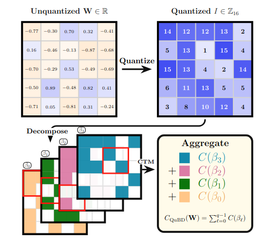

# QuBD Complexity 

Official repository for [Bakhtiarifard et al. (2026)](https://arxiv.org/abs/2605.15551) "Characterizing Learning in Deep Neural Networks using Tractable Algorithmic Complexity Analysis", published at NeurIPS 2026. 



## Scripts

### Main Results
Results in Figure 4 in the paper can be reproduced by running this script:

```
python train.py
```

### Complexity across models
Computes whole-model complexity for a list of timm models, comparing pretrained vs. random weights. Model names are read from `model_names_100.txt` (set `MODEL_NAMES_FILE` to use e.g. `model_names_5.txt`). Results are saved to `results/`, with the settings in the filename, e.g. `results/complexities_100models_robust_p99.9.json` (`USE_ROBUST_NORM`/`ROBUST_PERCENTILE`, default: clipping at 99.9 as in `train.py`) or `results/complexities_5models_bd16.json` (`BIT_DEPTHS = [16]`, no clipping). Results are saved after every model, and an interrupted run resumes where it stopped.

```
python complexity_per_model.py
```

### Complexity per layer 
Computes bitplane complexity per layer for 5 pretrained models (ResNet18, ResNet50, ViT-B/16, EfficientNet-B0, MobileNetV3), comparing pretrained vs. random weights. Model names are read from `model_names_5.txt`. Results are saved to e.g. `results/complexity_per_layer_5models_robust_p99.9.json` (same clipping settings as above).

```
python complexity_per_layer.py
```

###  Post-Training Quantization and QuBD Complexity

Evaluates post-training quantization (PTQ) accuracy for 5 pretrained models (ResNet18, ResNet50, ViT-B/16, EfficientNet-B0, MobileNetV3) on the ImageNet-1K validation set. Compares FP32, FP16, and per-channel uniform PTQ at bit depths 1–8. Results are saved to `results/ptq.json`.

```
python ptq.py
```

Utility module providing quantizer classes (`UniformQuantizer`, `UniformQuantizer_per_channel`) and helper functions (`attach_weight_quantizers`, `detach_weight_quantizers`, `toggle_quantization`) used by `ptq.py`. Not intended to be run directly.

### Plotting
`plot_figures.py` makes the figures from the results above and saves them to `figs/`. Pick one figure, and the clipping setting with `--percentile` (a percentile, or `none` for no clipping; default 99.9). The settings are in the figure's filename, e.g. `figs/per_layer_resnet50_bd8_robust_p99.99.pdf`.

| Figure | Needs results from |
|---|---|
| `ranked100`: per-plane complexity ratio of all 100 models, ranked by the MSB ratio (`--panels 4` or `8`) | `complexity_per_model.py` (100 models, 8-bit) |
| `per_layer`: per-layer complexity ratio on planes 7 and 6 (`--model`, default `resnet18`) | `complexity_per_layer.py` |
| `complexity_accuracy`: per-plane complexity ratio next to PTQ accuracy (`--bits`, default 16) | `complexity_per_model.py` (5 models, 16-bit) and `ptq.py` |

```
python plot_figures.py ranked100 --percentile 99.9 --panels 4
python plot_figures.py per_layer --model resnet50 --percentile none
python plot_figures.py complexity_accuracy --percentile 99.99
python plot_figures.py all    # every figure for every clipping setting (none, 99.99, 99.9); skips missing results
```

### Usage guidelines ###

* Kindly cite our publication if you use any part of the code

```
@inproceedings{bakh2026qubd,
        title={{Characterizing Learning in Deep Neural Networks using Tractable Algorithmic Complexity Analysis}},
        author={Pedram Bakhtiarifard, Sophia N. Wilson, Mahmoud Afifi, Jonathan Wenshøj and Raghavendra Selvan},
        booktitle={Advances in Neural Information Processing Systems (NeurIPS)},
        note={arXiv preprint arxiv:2605.15551},
        year={2026}}
```
### Who do I talk to? ###

* pba@di.ku.dk; raghav@di.ku.dk

